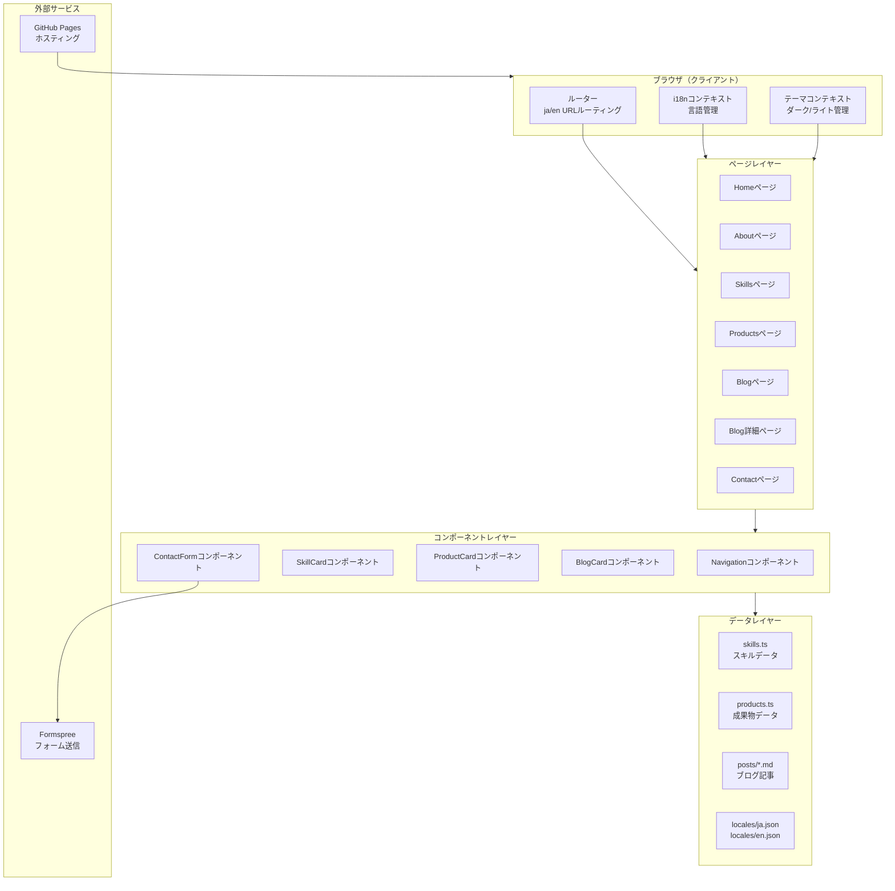
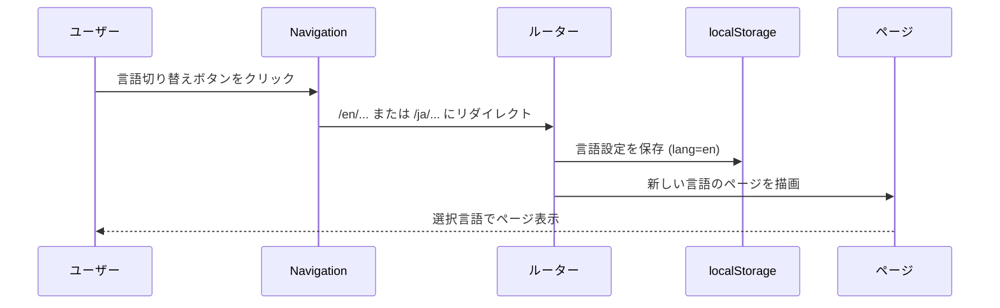
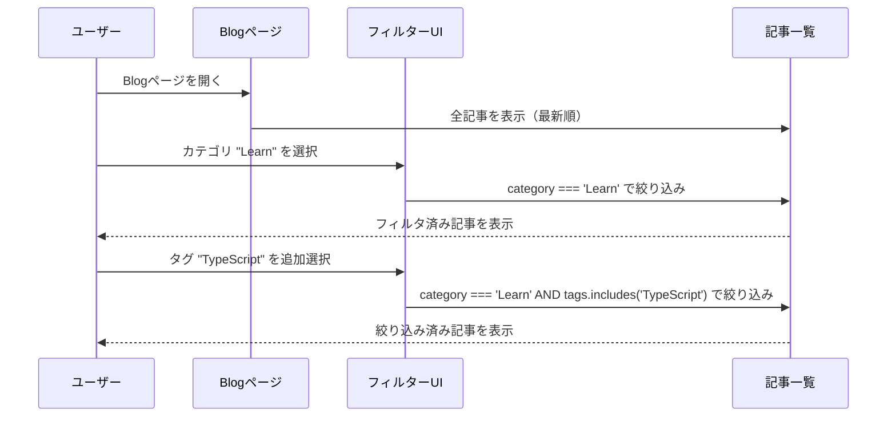
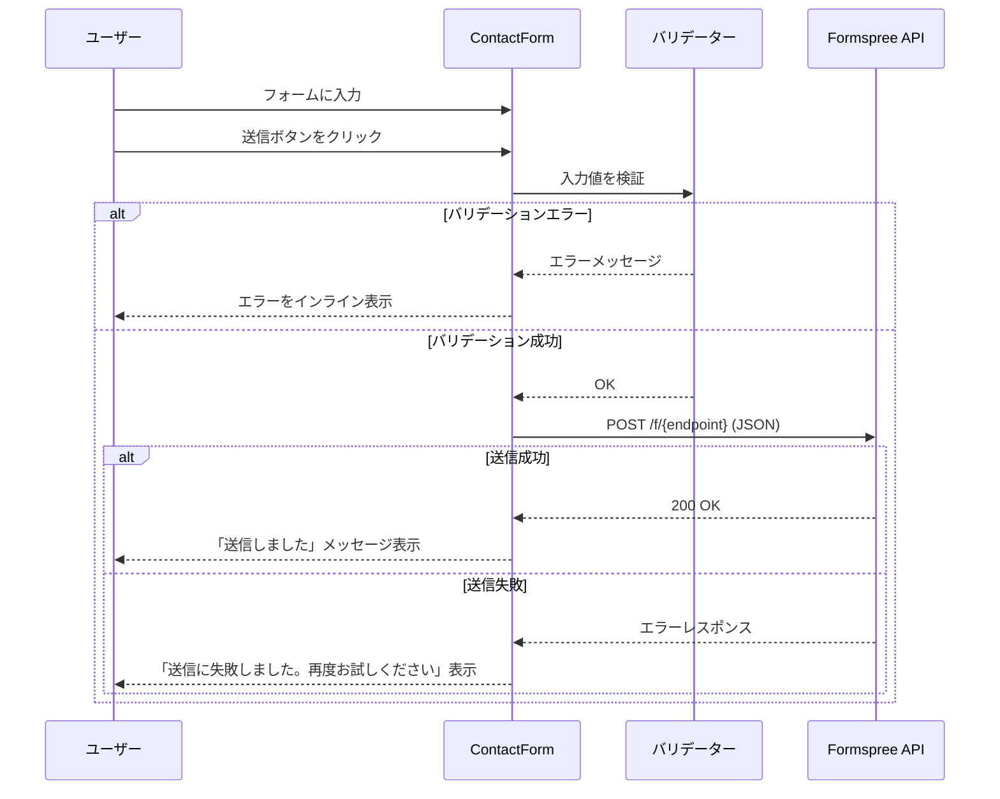
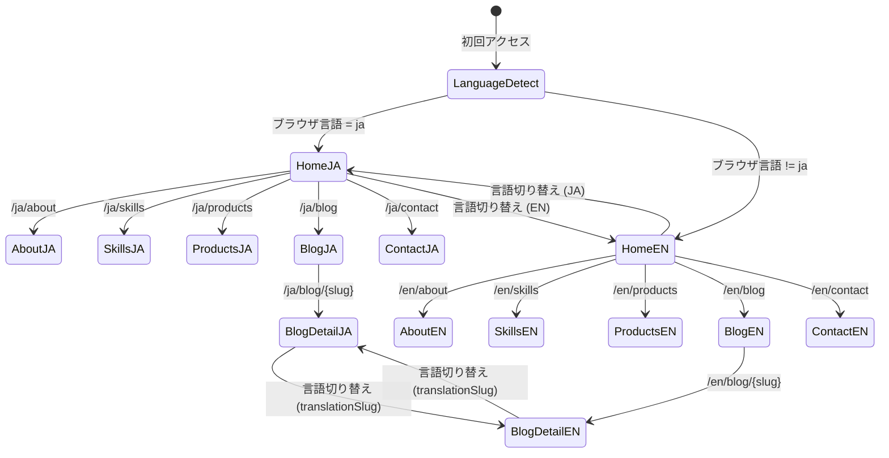

# 機能設計書 (Functional Design Document)

## システム構成図



---

## 技術スタック

| 分類 | 技術 | バージョン | 選定理由 |
|------|------|-----------|----------|
| 言語 | TypeScript | 5.x | 型安全なデータ管理、スキル・成果物データの型定義 |
| ランタイム | Node.js | v24.11.0 | ビルドツール実行環境 |
| UIフレームワーク | React | 19.x | コンポーネントベースUI・Context APIによる状態管理 |
| ルーティング | react-router-dom | 7.x | `/ja/`・`/en/` パスベース言語ルーティング |
| スタイリング | Tailwind CSS | 3.x | ダーク/ライトモードの `dark:` クラス対応、レスポンシブ対応 |
| ビルドツール | Vite | 6.x | 高速なHMR・バンドル、Markdownプラグイン対応 |
| Markdownパーサー | remark / rehype | 15.x / 13.x | Markdownブログ記事をHTMLに変換 |
| フロントマターパーサー | gray-matter | 4.x | Markdownファイルのメタデータ解析 |
| i18n | 独自実装（I18nContext + react-router-dom） | - | 追加依存なしで実現。Context APIで言語状態を管理し、react-router-domのURLパラメータで`/ja/`・`/en/`ルーティングを制御 |
| フォーム送信 | Formspree（@formspree/react） | 2.x | 静的サイトでのフォーム送信、サーバー不要 |
| ホスティング | GitHub Pages | - | 無料・高可用性・カスタムドメイン対応 |
| CI/CD | GitHub Actions | - | 自動ビルド・デプロイ |

---

## データモデル定義

### エンティティ: Skill（スキル）

```typescript
type SkillCategory = 'language' | 'framework' | 'tool';
type SkillLevel = 1 | 2 | 3 | 4 | 5;
// 1=入門, 2=初級, 3=中級, 4=上級, 5=エキスパート（言語カテゴリのみ使用。詳細は rules/glossary.md 参照）

interface Skill {
  id: string;            // 一意識別子（例: "typescript"）
  name: string;          // 表示名（例: "TypeScript"）
  category: SkillCategory; // カテゴリ
  level?: SkillLevel;    // 熟練度（category === 'language' の場合のみ）
  iconUrl?: string;      // アイコン画像パス（任意）
}
```

**制約**:
- `level` は `category === 'language'` の場合のみ設定する
- `id` はケバブケース（`react`, `node-js` など）
- `name` は表示用の正式名称

---

### エンティティ: Product（成果物）

```typescript
type ProductStatus = 'completed' | 'in-progress';

interface Product {
  id: string;              // 一意識別子（例: "portfolio-site"）
  title: string;           // 成果物名
  description: {
    ja: string;            // 日本語説明
    en: string;            // 英語説明
  };
  status: ProductStatus;   // ステータス
  tags: string[];          // 使用技術タグ（例: ["TypeScript", "Tailwind CSS"]）
  githubUrl?: string;      // GitHubリポジトリURL（任意）
  demoUrl?: string;        // デモURL（任意）
  imageUrl?: string;       // サムネイル画像パス（任意）
  order: number;           // 表示順（昇順）
}
```

**制約**:
- `tags` は空配列不可（最低1件）
- `order` はユニークな整数値

---

### エンティティ: BlogPost（ブログ記事）

ブログ記事はMarkdownファイルのフロントマターで定義する。

```typescript
type BlogCategory = 'Featured' | 'New' | 'Learn' | 'Enjoy' | 'Real';

// Markdownフロントマター定義
interface BlogPostFrontmatter {
  title: string;           // 記事タイトル
  date: string;            // 公開日（ISO 8601: "2026-04-16"）
  category: BlogCategory;  // カテゴリ
  tags: string[];          // タグ（例: ["TypeScript", "React"]）
  summary: string;         // 記事概要（一覧カードに表示）
  lang: 'ja' | 'en';       // 記事の言語
  translationSlug?: string; // 対応する翻訳記事のスラッグ
  draft?: boolean;         // trueの場合は非公開（デフォルト: false）
}

// ビルド時に生成される記事データ
interface BlogPost extends BlogPostFrontmatter {
  slug: string;            // URLスラッグ（ファイル名から生成）
  content: string;         // HTMLに変換済みの本文
  readingTime: number;     // 推定読了時間（分）
}
```

**制約**:
- ファイル名は `YYYY-MM-DD-{slug}.md` 形式
- `lang: 'ja'` と `lang: 'en'` の記事は `translationSlug` で相互参照する
- `draft: true` の記事はビルド時に除外する

---

### エンティティ: i18n翻訳データ

```typescript
interface LocaleData {
  nav: {
    home: string;
    about: string;
    skills: string;
    products: string;
    blog: string;
    contact: string;
  };
  home: {
    catchcopy: string;
    subtitle: string;
    viewWork: string;
    contactMe: string;
  };
  skills: {
    title: string;
    categories: {
      language: string;
      framework: string;
      tool: string;
    };
    levelLabel: string; // "熟練度" / "Proficiency"
  };
  products: {
    title: string;
    status: {
      completed: string;  // "完成" / "Completed"
      'in-progress': string; // "開発中" / "In Progress"
    };
    github: string;
    demo: string;
  };
  about: {
    title: string;
    bio: string;       // 自己紹介文
    career: string;    // 経歴見出し
  };
  blog: {
    title: string;
    categories: Record<BlogCategory, string>;
    readMore: string;
    readingTime: string; // "{n} min read"
  };
  contact: {
    title: string;
    name: string;
    email: string;
    phone: string;
    message: string;
    submit: string;
    successMessage: string;
    errorMessage: string;
  };
}
```

---

## コンポーネント設計

### Navigation コンポーネント

**責務**:
- ページ間のリンクナビゲーション
- 言語切り替え（JA / EN）
- ダーク/ライトモード切り替え
- モバイルハンバーガーメニュー

**インターフェース**:
```typescript
// Navigation は I18nContext / ThemeContext を直接参照するため、
// 言語・テーマ変更の props は不要。
interface NavigationProps {
  currentPath: string;
}
```

**内部状態**:
- `isMenuOpen: boolean` — モバイルメニュー開閉状態

---

### SkillCard コンポーネント

**責務**:
- スキル名・アイコン・カテゴリの表示
- 言語カテゴリの場合のみ熟練度バーを表示

**インターフェース**:
```typescript
interface SkillCardProps {
  skill: Skill;
}
```

**熟練度バー表示ロジック**:
- `skill.category === 'language'` かつ `skill.level` が存在する場合のみ5段階バーを描画
- それ以外はアイコン+名前のシンプル表示

---

### ProductCard コンポーネント

**責務**:
- 成果物タイトル・説明・サムネイルの表示
- ステータスバッジ（開発中 / 完成）の表示
- 技術タグの一覧表示
- GitHubリンク・デモリンクボタンの表示

**インターフェース**:
```typescript
interface ProductCardProps {
  product: Product;
  lang: 'ja' | 'en';
}
```

---

### BlogCard コンポーネント

**責務**:
- 記事タイトル・カテゴリ・日付・概要の表示
- 推定読了時間（`readingTime`）の表示
- 記事詳細ページへのリンク

**インターフェース**:
```typescript
interface BlogCardProps {
  post: BlogPost;
  lang: 'ja' | 'en';
}
```

---

### ContactForm コンポーネント

**責務**:
- フォーム入力の管理とバリデーション
- Formspree API への送信
- 送信成功・失敗のフィードバック表示

**インターフェース**:
```typescript
interface ContactFormProps {
  formId: string; // @formspree/react の useForm() に渡す Formspree フォームID（環境変数で注入）
  lang: 'ja' | 'en';
}

interface FormValues {
  name: string;
  email: string;
  phone?: string;
  message: string;
  _honeypot: string; // スパム対策（常に空文字）
}
```

**バリデーションルール**:
- `name`: 必須、1〜100文字
- `email`: 必須、メール形式
- `phone`: 任意、電話番号形式（入力があれば検証）
- `message`: 必須、10〜2000文字

---

## ユースケース図

### ユースケース1: 言語切り替え



### ユースケース2: ブログ記事フィルタリング



### ユースケース3: お問い合わせフォーム送信



---

## 画面遷移図



---

## ファイル構造

```
src/
├── data/
│   ├── skills.ts          # スキルデータ（Skill[]）
│   └── products.ts        # 成果物データ（Product[]）
│
├── locales/
│   ├── ja.json            # 日本語翻訳
│   └── en.json            # 英語翻訳
│
├── posts/
│   ├── ja/
│   │   └── YYYY-MM-DD-{slug}.md  # 日本語記事
│   └── en/
│       └── YYYY-MM-DD-{slug}.md  # 英語記事
│
├── pages/
│   └── [lang]/            # 言語パスパラメータ（'ja' | 'en'）
│       ├── Home.tsx       # /ja/ または /en/
│       ├── About.tsx
│       ├── Skills.tsx
│       ├── Products.tsx
│       ├── blog/
│       │   ├── BlogList.tsx    # /ja/blog
│       │   └── BlogDetail.tsx  # /ja/blog/{slug}
│       └── Contact.tsx
│
└── components/
    ├── Navigation.tsx
    ├── Footer.tsx
    ├── SkillCard.tsx
    ├── ProductCard.tsx
    ├── BlogCard.tsx
    ├── ContactForm.tsx
    ├── ThemeToggle.tsx
    ├── LanguageSwitcher.tsx
    └── StatusBadge.tsx
```

**データファイル例（skills.ts）**:
```typescript
import { Skill } from '../types';

export const skills: Skill[] = [
  { id: 'typescript', name: 'TypeScript', category: 'language', level: 4 },
  { id: 'javascript', name: 'JavaScript', category: 'language', level: 4 },
  { id: 'react',      name: 'React',      category: 'framework' },
  { id: 'tailwind',   name: 'Tailwind CSS', category: 'framework' },
  { id: 'git',        name: 'Git',         category: 'tool' },
];
```

---

## i18n 実装設計

### URL 構造

| 言語 | URL例 |
|------|-------|
| 日本語 | `/ja/`, `/ja/about`, `/ja/blog/hello-world` |
| 英語 | `/en/`, `/en/about`, `/en/blog/hello-world` |

**スラッグ生成ルール**: ファイル名 `2026-04-16-hello-world.md` からスラッグを生成する際、**日付プレフィックス（`YYYY-MM-DD-`）は除去**する。URL は `/ja/blog/hello-world` となる。

### 初回アクセス時の言語判定ロジック

```typescript
function detectInitialLanguage(): 'ja' | 'en' {
  // 1. localStorageに保存済みの設定を優先
  const saved = localStorage.getItem('lang');
  if (saved === 'ja' || saved === 'en') return saved;

  // 2. ブラウザの言語設定を確認
  const browserLang = navigator.language.toLowerCase();
  if (browserLang.startsWith('ja')) return 'ja';

  // 3. デフォルトは英語
  return 'en';
}
```

---

## テーマ（ダーク/ライト）実装設計

### 初回アクセス時のテーマ判定ロジック

```typescript
function detectInitialTheme(): 'dark' | 'light' {
  // 1. localStorageに保存済みの設定を優先
  const saved = localStorage.getItem('theme');
  if (saved === 'dark' || saved === 'light') return saved;

  // 2. システムのカラースキームを確認
  if (window.matchMedia('(prefers-color-scheme: dark)').matches) return 'dark';

  // 3. デフォルトはライト
  return 'light';
}
```

### Tailwind CSS 設定

```typescript
// tailwind.config.ts
import type { Config } from 'tailwindcss';

export default {
  darkMode: 'class', // <html class="dark"> で切り替え
  // ...
} satisfies Config;
```

---

## パフォーマンス最適化

- **画像最適化**: WebP形式を使用、`` で遅延読み込み
- **静的生成**: ビルド時に全ページをHTMLとして生成（SSG）
- **コード分割**: ページ単位でJavaScriptを分割し、初期ロード量を削減
- **フォント最適化**: Google Fontsを使用する場合は `font-display: swap` を設定

---

## セキュリティ考慮事項

- **フォームスパム対策**: honeypotフィールド（`_honeypot`）を設置し、入力があれば送信をブロック
- **外部スクリプト**: CDN経由で読み込む外部スクリプトにはSRI（Subresource Integrity）ハッシュを付与
- **環境変数**: FormspreeエンドポイントIDはソースコードにハードコードせず、ビルド時の環境変数（`VITE_FORMSPREE_ENDPOINT`）として注入
- **XSS対策**: Markdownから生成されたHTMLはサニタイズ済みのrehypeプラグインを使用

---

## エラーハンドリング

### エラーの分類

| エラー種別 | 発生箇所 | 処理 | ユーザーへの表示 |
|-----------|---------|------|-----------------|
| フォームバリデーションエラー | ContactForm | 送信をブロック、フィールドにエラー表示 | 「メールアドレスの形式が正しくありません」など |
| Formspree送信失敗 | ContactForm | エラーをキャッチしてUIに反映 | 「送信に失敗しました。しばらく後に再度お試しください」 |
| 存在しないブログ記事スラッグ | Blog詳細ページ | 404ページにリダイレクト | 「ページが見つかりません」 |
| 画像読み込み失敗 | ProductCard等 | `onError` でプレースホルダー画像に差し替え | プレースホルダー画像を表示 |
| ビルドエラー | GitHub Actions CI | デプロイをブロック | （ユーザーには影響しない） |

---

## テスト戦略

### ユニットテスト
- `detectInitialLanguage()` のロジック
- `detectInitialTheme()` のロジック
- フォームバリデーション関数
- ブログ記事のソート・フィルタリングロジック

### 統合テスト
- データファイル（skills.ts, products.ts）の型整合性（TypeScriptビルドで保証）
- Markdownファイルのフロントマター必須項目チェック（ビルド時バリデーション）

### E2Eテスト（手動確認）
- 言語切り替えで全ページのテキストが切り替わること
- ダーク/ライトモード切り替えでスタイルが変わること
- お問い合わせフォームの送信フロー
- モバイル・タブレット・デスクトップでのレイアウト確認
