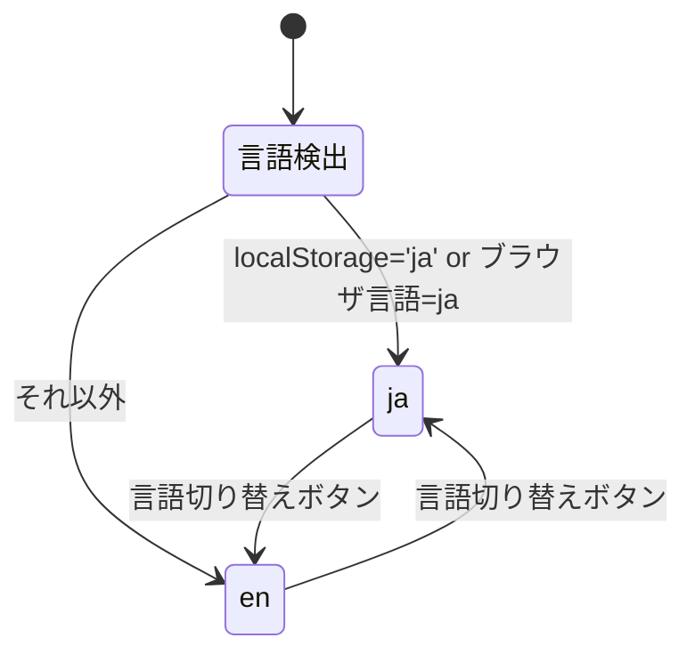

# プロジェクト用語集 (Glossary)

## 概要

このドキュメントは、HarutarouKawamoto Portfolio プロジェクト内で使用される用語の定義を管理します。
ドキュメント・コード・会話で用語を統一することで、認識のズレを防ぐことが目的です。

**更新日**: 2026-04-16

---

## ドメイン用語

プロジェクト固有のビジネス概念・機能に関する用語。

### ポートフォリオ

**定義**: エンジニアとしての自己紹介・スキル・成果物を公開するウェブサイト全体。

**説明**: 本プロジェクトの成果物そのもの。採用担当者とエンジニア友人の両方をターゲットとし、6つのページ（Home / About / Skills / Products / Blog / Contact）で構成される。

**英語表記**: Portfolio

---

### ブログ記事 / Blog Post

**定義**: 技術的な学習・発見・実践を記録したMarkdown形式の文章コンテンツ。

**説明**: `src/posts/{lang}/YYYY-MM-DD-{slug}.md` として管理される。日本語記事には対応する英語記事（翻訳）が存在し、`translationSlug` で相互参照する。投稿頻度の目標は `rules/product-requirements.md` の成功指標(KPI)を参照。

**関連用語**: フロントマター、スラッグ、ブログカテゴリ

---

### ブログカテゴリ / Blog Category

**定義**: ブログ記事に付与される分類タグ。記事の性質を表す5種類から1つを選択する。

**説明**:

| カテゴリ | 意味 | 用途例 |
|---------|------|-------|
| `Featured` | 特集・注目記事 | 最も伝えたい内容 |
| `New` | 最新情報・ニュース | 新技術の紹介 |
| `Learn` | 学習・チュートリアル | 技術を学んだ記録 |
| `Enjoy` | 趣味・楽しんで書いた | 個人的な興味 |
| `Real` | 実体験・実案件 | 実際の開発経験 |

**関連用語**: タグ、ブログ記事

---

### タグ / Tag

**定義**: ブログ記事に付与できる自由なキーワード。カテゴリと組み合わせてフィルタリングに使用する。

**説明**: カテゴリとは異なり、複数付与可能で自由に定義できる。使用技術名（`TypeScript`, `React`）や概念（`設計`, `パフォーマンス`）などを設定する。

**関連用語**: ブログカテゴリ

---

### 成果物 / Product

**定義**: 実際に開発したアプリケーション・ツール・OSS等のソフトウェア成果物。

**説明**: `src/data/products.ts` で管理され、Productsページにカード形式で表示される。ステータス（完成 / 開発中）、使用技術タグ、GitHubリンク、デモリンクを持つ。

**関連用語**: 成果物ステータス

---

### 成果物ステータス / Product Status

**定義**: 成果物の開発進捗を表す2種類の状態。

| ステータス | 値 | 意味 |
|-----------|-----|------|
| 完成 | `completed` | 公開・リリース済みで主要機能が完成している |
| 開発中 | `in-progress` | 現在開発中、または未完成 |

---

### スキル熟練度 / Skill Level

**定義**: プログラミング言語カテゴリのスキルに付与される1〜5の5段階評価。

**説明**: フレームワーク・ツールカテゴリには熟練度を付与しない。

| レベル | 意味 |
|-------|------|
| 1 | 入門（学習中・基礎文法を理解） |
| 2 | 初級（小規模プログラムを書ける） |
| 3 | 中級（実用的なアプリケーションを開発できる） |
| 4 | 上級（設計・最適化・高度な機能を扱える） |
| 5 | エキスパート（深い仕様理解・コントリビューション可能） |

---

### フロントマター / Frontmatter

**定義**: Markdownファイルの先頭に `---` で区切られたYAML形式のメタデータブロック。

**説明**: ブログ記事のタイトル・日付・カテゴリ・タグ・概要・言語情報を記述する。ビルド時に `gray-matter` で解析される。

**使用例**:
```markdown
---
title: "TypeScript型システム入門"
date: "2026-04-16"
category: "Learn"
tags: ["TypeScript", "型システム"]
summary: "TypeScriptの型推論と型注釈の基本を解説します。"
lang: "ja"
translationSlug: "typescript-type-system-intro"
---
```

**関連用語**: ブログ記事、スラッグ

---

### スラッグ / Slug

**定義**: URLに使用される記事・ページの識別子。kebab-case の英数字文字列。

**説明**: ブログ記事のファイル名から `YYYY-MM-DD-` プレフィックスを除いた部分。URL `/ja/blog/typescript-tips` の `typescript-tips` 部分がスラッグ。翻訳記事の相互参照にも使用する（`translationSlug`）。

**関連用語**: フロントマター

---

## 技術用語

プロジェクトで使用している技術・フレームワーク・ツールに関する用語。

### TypeScript

**定義**: Microsoft製のJavaScriptに静的型付けを追加したプログラミング言語。

**本プロジェクトでの用途**: 全ソースコードの記述言語。スキル・成果物・ブログ記事のデータ型定義、コンポーネントProps型定義に使用。

**バージョン**: 5.x

**関連ドキュメント**: `rules/architecture.md`

---

### Tailwind CSS

**定義**: ユーティリティクラスベースのCSSフレームワーク。

**本プロジェクトでの用途**: 全コンポーネントのスタイリング。`dark:` クラスでダーク/ライトモード対応、`sm:`/`md:`/`lg:` クラスでレスポンシブ対応を実装。

**バージョン**: 3.x

---

### Vite

**定義**: 高速な開発サーバーとビルドツール。

**本プロジェクトでの用途**: 開発時のHMR（Hot Module Replacement）と本番ビルド（静的HTMLへのコンパイル）。

**バージョン**: 6.x

---

### Formspree

**定義**: 静的サイト向けのフォームバックエンドSaaS。

**本プロジェクトでの用途**: Contactページのお問い合わせフォーム送信先。サーバーレスでフォームデータを受信・転送する。エンドポイントIDは環境変数 `VITE_FORMSPREE_ENDPOINT` で管理。

**バージョン**: @formspree/react 2.x

---

### GitHub Pages

**定義**: GitHubリポジトリから静的サイトをホスティングするサービス。

**本プロジェクトでの用途**: 本番環境のホスティング先。GitHub Actionsでビルドした成果物（`dist/`）を自動デプロイ。

**デプロイURL**: `https://HarutarouKawamoto.github.io/`

---

### remark / rehype

**定義**: Markdownを処理するためのプロセッサーライブラリ群。remarkはMarkdown→AST変換、rehypeはAST→HTML変換を担当。

**本プロジェクトでの用途**: ブログ記事のMarkdownをHTMLに変換。`rehype-sanitize` でXSS対策のサニタイズを行う。

**バージョン**: remark 15.x / rehype 13.x

---

### React

**定義**: Meta製のUIライブラリ。コンポーネントベースでUIを構築する。

**本プロジェクトでの用途**: 全UIコンポーネントの構築。Concurrent Features（`useTransition` 等）を含む React 19 を採用。

**バージョン**: 19.x

---

### react-router-dom

**定義**: React向けのクライアントサイドルーティングライブラリ。

**本プロジェクトでの用途**: URL構造（`/ja/about` 等）の管理とページ遷移。`<BrowserRouter>` + `<Routes>` + `<Route>` で i18n対応ルーティングを構成。GitHub Pages での直接URLアクセス問題は `public/404.html` フォールバック方式で対処（詳細は `rules/architecture.md` 参照）。

**バージョン**: 7.x

---

### gray-matter

**定義**: Markdownファイルのフロントマター（YAML）を解析するNode.jsライブラリ。

**本プロジェクトでの用途**: ブログ記事Markdownファイルのフロントマターを解析し、`slug`, `title`, `date`, `category` 等のメタデータを取得する。ビルド時に `src/lib/blog.ts` で使用。

**バージョン**: 4.x

---

### Node.js

**定義**: JavaScriptランタイム環境。

**本プロジェクトでの用途**: ビルドツール（Vite）・テストランナー（Vitest）・ESLint等の実行環境。ブラウザ上では動作しない（ビルド時のみ使用）。

**バージョン**: v24.11.0 (LTS)

---

### npm

**定義**: Node.js のデフォルトパッケージマネージャー。

**本プロジェクトでの用途**: 依存関係のインストール・管理。`package-lock.json` によるバージョン固定。主要コマンドは `rules/development-guidelines.md` の「主要な npm スクリプト」を参照。

**バージョン**: 11.x（Node.js v24.11.0 に同梱）

---

### ESLint

**定義**: JavaScript/TypeScript の静的解析ツール。

**本プロジェクトでの用途**: コーディング規約の自動チェック。ESLint 9.x の Flat Config 形式（`eslint.config.js`）を使用。有効ルールは `rules/development-guidelines.md` の「ESLint 規約」を参照。

**バージョン**: 9.x

---

### Prettier

**定義**: コードフォーマッター。

**本プロジェクトでの用途**: TypeScript/TSX/JSON ファイルのスタイル統一。保存時自動フォーマット（VSCode 設定）。`prettier-plugin-tailwindcss` で Tailwind クラスを自動整列。設定は `.prettierrc` で管理。

**バージョン**: 3.x

---

### Vitest

**定義**: Vite ベースの高速ユニットテストフレームワーク。

**本プロジェクトでの用途**: `src/lib/` 配下の純粋関数のユニットテスト。`vitest.config.ts` でカバレッジ閾値（80%以上）を設定。`npm run test` で実行。

**バージョン**: 2.x

---

## 略語・頭字語

### i18n

**正式名称**: Internationalization（国際化）

**意味**: ソフトウェアを複数の言語・地域に対応させる設計・実装のこと。「i」と「n」の間に18文字あることから i18n と略される。

**本プロジェクトでの使用**: 日本語（`ja`）と英語（`en`）の2言語対応。`src/locales/` の翻訳ファイル、`src/contexts/I18nContext.tsx`、URL構造（`/ja/`・`/en/`）全体を指す。

---

### SSG

**正式名称**: Static Site Generation（静的サイト生成）

**意味**: ビルド時にHTMLファイルを事前生成するウェブサイト構築手法。サーバーサイドで動的にHTMLを生成するSSRとは異なり、サーバーが不要。

**本プロジェクトでの使用**: ViteでビルドしてGitHub Pagesにデプロイするアーキテクチャ全体。

---

### SPA

**正式名称**: Single Page Application（シングルページアプリケーション）

**意味**: 最初に1つのHTMLファイルを読み込み、ページ遷移をJavaScriptで制御するウェブアプリケーション。

**本プロジェクトでの使用**: react-router-domによるクライアントサイドルーティング。`/ja/about` などのURLは全て `index.html` から始まりJSでルーティングされる。

---

### HMR

**正式名称**: Hot Module Replacement（ホットモジュール置き換え）

**意味**: 開発中にコードを変更したとき、ブラウザをフルリロードせずに変更されたモジュールだけを差し替えるViteの機能。

**本プロジェクトでの使用**: `npm run dev` 実行時の開発体験向上のために使用。

---

### CSP

**正式名称**: Content Security Policy（コンテンツセキュリティポリシー）

**意味**: ウェブページが読み込めるリソースの種類・来源を制限するHTTPヘッダー（またはmetaタグ）。XSS攻撃の軽減が目的。

**本プロジェクトでの使用**: `index.html` のmetaタグでCSPを設定。`connect-src` を Formspree のみに制限している。

---

### Lang / 言語コード

**正式名称**: Language Code（ISO 639-1）

**意味**: 言語を2文字で表すISOコード。

**本プロジェクトでの使用**:
- `ja`: 日本語（Japanese）
- `en`: 英語（English）

型定義: `type Lang = 'ja' | 'en'`

---

## アーキテクチャ用語

### コンポーネントレイヤー構造

**定義**: UIを責務ごとに3層に分離するアーキテクチャパターン。

**本プロジェクトでの適用**:
```
pages/         ← URLルートと1対1（ページの組み立て）
  ↓
components/    ← 再利用可能なUI部品
  ↓
data/ / lib/   ← 型付き静的データ・ユーティリティ関数
```

**関連コンポーネント**: `src/pages/`, `src/components/`, `src/data/`, `src/lib/`

---

### コンテキスト / Context

**定義**: Reactのコンテキスト（Context API）。グローバルな状態をコンポーネントツリー全体で共有する仕組み。

**本プロジェクトでの適用**:
- `I18nContext`: 現在の言語（`ja`/`en`）と切り替え関数を提供
- `ThemeContext`: 現在のテーマ（`dark`/`light`）と切り替え関数を提供

---

## ステータス・状態

### 言語ステータス

| ステータス | 値 | 意味 |
|-----------|-----|------|
| 日本語 | `ja` | 日本語表示・`/ja/` URLパス |
| 英語 | `en` | 英語表示・`/en/` URLパス |

**状態遷移**:


---

### テーマステータス

| ステータス | 値 | 意味 |
|-----------|-----|------|
| ダークモード | `dark` | 暗い背景・`<html class="dark">` |
| ライトモード | `light` | 明るい背景・`<html>` |

---

### フォーム送信ステータス

| ステータス | 値 | 意味 |
|-----------|-----|------|
| 未送信 | `idle` | フォーム入力中 |
| 送信中 | `loading` | Formspree API への POST中 |
| 送信成功 | `success` | 送信完了・成功メッセージ表示 |
| 送信失敗 | `error` | 送信失敗・エラーメッセージ表示 |

---

## データモデル用語

### Skill（スキルエンティティ）

**定義**: スキルページに表示される技術スキル1件のデータ。

**主要フィールド**:
- `id`: 識別子（kebab-case）例: `"typescript"`
- `name`: 表示名 例: `"TypeScript"`
- `category`: カテゴリ `'language' | 'framework' | 'tool'`（型: `SkillCategory`）
- `level?`: 熟練度 1〜5（言語カテゴリのみ）
- `iconUrl?`: アイコン画像パス（任意）

**SkillCategory の表示名マッピング**:

| 型値 | 表示名（ja） | 表示名（en） |
|------|------------|------------|
| `'language'` | プログラミング言語 | Languages |
| `'framework'` | フレームワーク | Frameworks |
| `'tool'` | ツール | Tools |

**管理場所**: `src/data/skills.ts`

---

### Product（成果物エンティティ）

**定義**: Productsページに表示される成果物1件のデータ。

**主要フィールド**:
- `id`: 識別子（kebab-case）
- `title`: 成果物名
- `description`: 日英の説明文オブジェクト `{ ja: string; en: string }`
- `status`: `'completed' | 'in-progress'`
- `tags`: 使用技術タグ配列
- `githubUrl?`: GitHubリポジトリURL
- `demoUrl?`: デモURL
- `imageUrl?`: サムネイル画像パス（省略時はデフォルト画像を表示）
- `order`: 表示順（数値。小さい方が上位に表示）

**管理場所**: `src/data/products.ts`

---

### BlogPost（ブログ記事エンティティ）

**定義**: ブログ記事1件のデータ。Markdownファイルから生成される。

**主要フィールド**:
- `slug`: URLスラッグ（ファイル名から生成）
- `title`: 記事タイトル
- `date`: 公開日（ISO 8601）
- `category`: `BlogCategory`
- `tags`: タグ配列
- `summary`: 記事概要（一覧カードに表示）
- `lang`: 記事言語 `'ja' | 'en'`
- `translationSlug?`: 対応翻訳記事のスラッグ
- `content`: HTMLに変換済みの本文
- `readingTime`: 推定読了時間（分）
- `draft?`: `true` の場合は未公開（一覧・RSSに含めない）。省略時は公開扱い

**管理場所**: `src/posts/{ja|en}/YYYY-MM-DD-{slug}.md`
